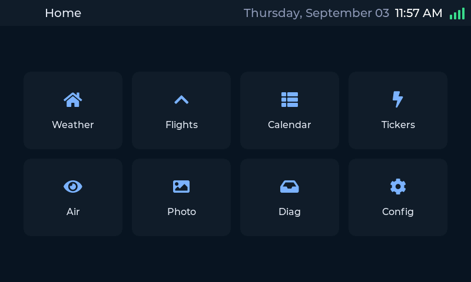
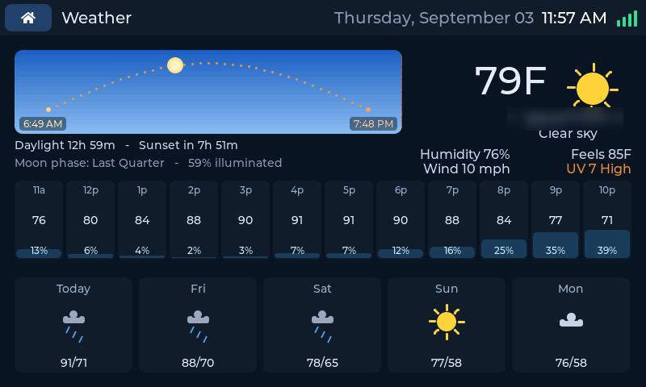
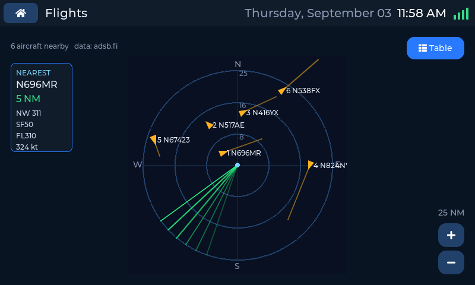
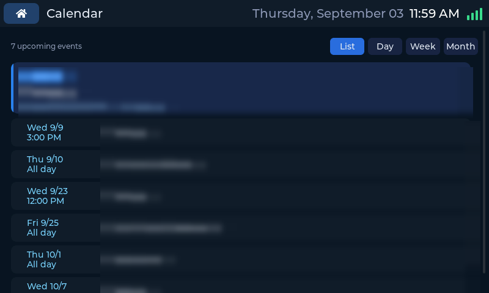
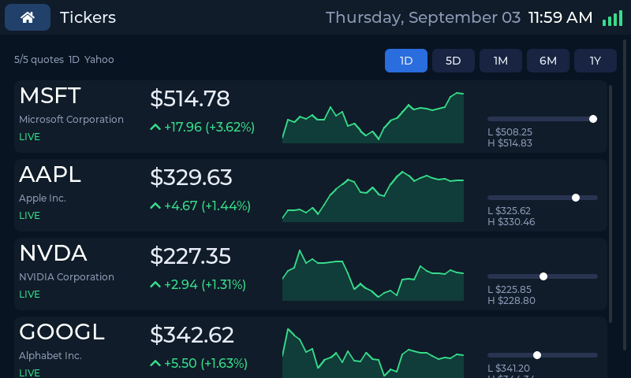
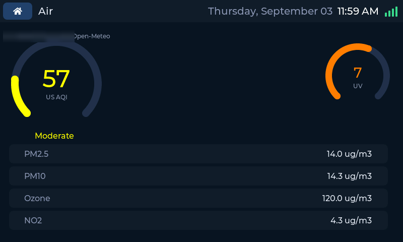
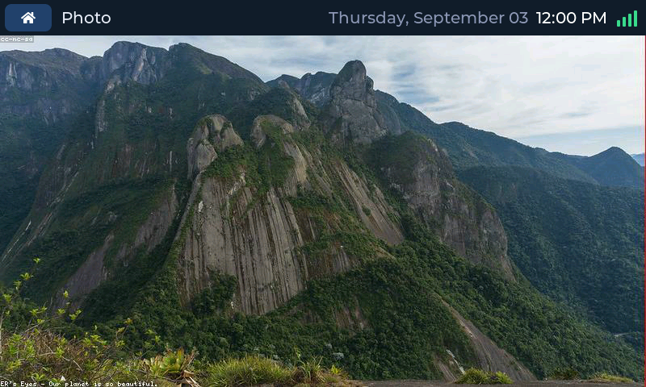
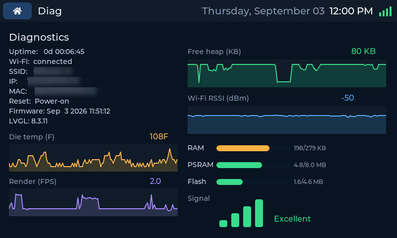
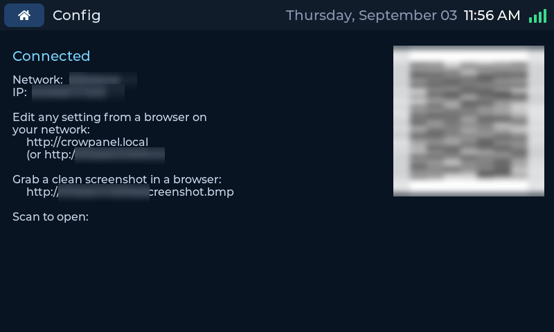
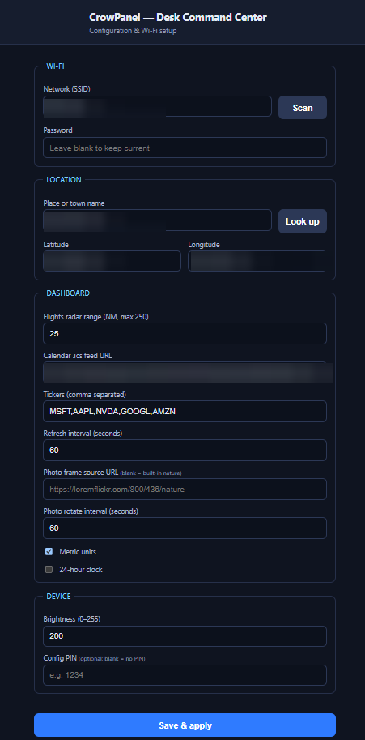

# CrowPanel 5.0" — Desk Command Center

A touchscreen desk dashboard for the **Elecrow CrowPanel ESP32 HMI 5.0"** display,
built with **PlatformIO + LVGL**. It shows the time, local weather, **live aircraft
flying nearby (with tail numbers)**, your calendar, market tickers, air/environment
readings, and a rotating **photo frame** of nature shots — all configured from a phone or
laptop through a built-in web page (no code edits, no re-flashing to change settings).

> **Status:** working prototype. Board bring-up (display, touch, LVGL shell), Wi-Fi
> provisioning, the web config portal, and every data tab — clock/weather, flights radar,
> calendar, tickers, air/UV, and the photo frame — are implemented.

> 🛠️ **All the technical detail** — pin map, display driver, module design, data flow,
> build config — lives in **[architecture.md](architecture.md)**. This README is the
> high-level tour.

---

## The board

**Elecrow CrowPanel ESP32 HMI 5.0"** — module marking **DIS07050H**.

| | |
|---|---|
| **MCU** | ESP32-S3-WROOM-1-N4R8 (Xtensa dual-core @ 240 MHz) |
| **Flash / PSRAM** | 4 MB flash, **8 MB Octal PSRAM** |
| **Wireless** | Wi-Fi 2.4 GHz b/g/n + BLE 5.0 |
| **Display** | 5.0" 800×480 TFT-LCD, 16-bit parallel RGB (RGB565) |
| **Touch** | GT911 capacitive, I²C |
| **Extras** | microSD, I²S audio (speaker connector), PWM backlight, battery input + charging |
| **Buttons** | BOOT, RST |

> ⚠️ **This is the 5.0" board (DIS07050H), *not* the 7.0" (DIS08070H)** — the two boards
> use different RGB pin maps and timings, so their display configs are not interchangeable.

- Elecrow wiki: <https://www.elecrow.com/wiki/esp32-display-502727-intelligent-touch-screen-wi-fi-ble-560.html>
- Elecrow GitHub (examples): <https://github.com/Elecrow-RD/CrowPanel-5.0-HMI-ESP32-Display-800x480>

---

## What it does

A left-sidebar, multi-page LVGL dashboard:

| Tab | Shows | Data source |
|---|---|---|
| **Home** | Big local time + date, current weather, sun/moon, hourly outlook | NTP + Open-Meteo |
| **Flights** | Live radar of nearby aircraft — tail number, type, altitude, distance | adsb.fi |
| **Calendar** | Upcoming events | your `.ics` feed |
| **Tickers** | Stock / crypto prices with sparklines | Yahoo Finance |
| **Air** | US air-quality index + UV | Open-Meteo |
| **Photo** | Full-screen nature photo frame, auto-rotating (default 60 s) | LoremFlickr (or any JPEG URL) |
| **Diag** | Uptime, heap/PSRAM, Wi-Fi, reset reason, firmware | on-device |
| **Config** | Where to configure the device (URL + QR) | — |

All data APIs are **keyless**. Flight data is credited to **adsb.fi** (non-commercial use).

---

## The screens

A left-sidebar, multi-page LVGL app. Every shot below is captured straight from the device
framebuffer through the built-in **`/screenshot.bmp`** endpoint (see
[Grabbing screenshots](#grabbing-screenshots)) — personal details (Wi-Fi name, location,
calendar, IP/MAC) are blurred.

<table>
<tr>
<td width="50%"><br><b>Home</b> — tap-tile launcher with the clock and date across the top; tap a tile to open that tab.</td>
<td width="50%"><br><b>Weather</b> — current conditions, daylight/sun times, moon phase, an hourly strip and a 5-day outlook.</td>
</tr>
<tr>
<td><br><b>Flights</b> — live ADS-B radar of aircraft overhead; the nearest flight (tail #, type, altitude, speed) is called out on the left. Pinch the range 1–250 NM.</td>
<td><br><b>Calendar</b> — upcoming events from your <code>.ics</code> feed, with the next event highlighted and List/Day/Week/Month views.</td>
</tr>
<tr>
<td><br><b>Tickers</b> — stock/crypto quotes with intraday sparklines and day range; selectable 1D–1Y timeframe.</td>
<td><br><b>Air</b> — US AQI gauge and UV index with a PM2.5 / PM10 / ozone / NO₂ breakdown.</td>
</tr>
<tr>
<td><br><b>Photo</b> — full-bleed nature photo frame that auto-rotates on a configurable interval.</td>
<td><br><b>Diag</b> — live device stats: uptime, free heap/PSRAM, Wi-Fi RSSI, die temp and render FPS.</td>
</tr>
</table>

Configuration happens in the browser — the on-device **Config** tab just points you there:

<table>
<tr>
<td width="50%"><br><b>Config (on device)</b> — the setup URL plus a scannable QR code to open the web portal.</td>
<td width="50%"><br><b>Web portal</b> — the full settings page served at <code>http://crowpanel.local</code> from any phone or laptop.</td>
</tr>
</table>

### Grabbing screenshots

The firmware serves a pixel-perfect capture of whatever is currently on screen at
**`http://crowpanel.local/screenshot.bmp`** (or `http://<device-ip>/screenshot.bmp`). Open
it in a browser — or `curl` it — to save an 800×480 24-bit BMP straight from the
framebuffer. The **Config** tab shows this URL on the device. If a config PIN is set, it
gates the screenshot too.

---

## Configuring it

Everything is set from a **web page** — nothing is typed on the touchscreen. On first
boot the device starts a **`CrowPanel-setup`** Wi-Fi hotspot with a captive portal; join
it from your phone (the screen shows a QR code) and enter your home Wi-Fi and location.
After that, open **`http://crowpanel.local`** from any device on your network to change
any setting. Hold **BOOT (~5 s at power-on)** to wipe Wi-Fi and return to setup.

The full provisioning model and web-portal internals are in
[architecture.md](architecture.md).

---

## Build & flash

**Prerequisites:** [VS Code](https://code.visualstudio.com/) with the
[PlatformIO IDE](https://platformio.org/install/ide?install=vscode) extension (or the
PlatformIO CLI).

```sh
pio run                 # build
pio run -t upload       # flash over USB-C
pio device monitor      # serial console @ 115200 (UART0 via the onboard CH340 bridge)
```

On first boot the screen shows the **Config** tab with setup instructions — join the
`CrowPanel-setup` hotspot to finish. Toolchain and build-flag specifics are in
[architecture.md](architecture.md).

---

## Credits & license

- Board & examples: **Elecrow** ([wiki](https://www.elecrow.com/wiki/), [GitHub](https://github.com/Elecrow-RD))
- Flight data: **[adsb.fi](https://adsb.fi/)** (credit required, non-commercial)
- Weather / air / UV: **[Open-Meteo](https://open-meteo.com/)**
- Tickers: **Yahoo Finance** chart API
- Photo frame: **[LoremFlickr](https://loremflickr.com/)** (default source; any JPEG URL works)
- **[LVGL](https://lvgl.io/)**, **[ArduinoJson](https://arduinojson.org/)**,
  **[ESPAsyncWebServer](https://github.com/mathieucarbou/ESPAsyncWebServer)**,
  **[JPEGDEC](https://github.com/bitbank2/JPEGDEC)**,
  **[pioarduino](https://github.com/pioarduino/platform-espressif32)** (Arduino-ESP32 / ESP-IDF)

License: MIT (add a `LICENSE` file to confirm).
