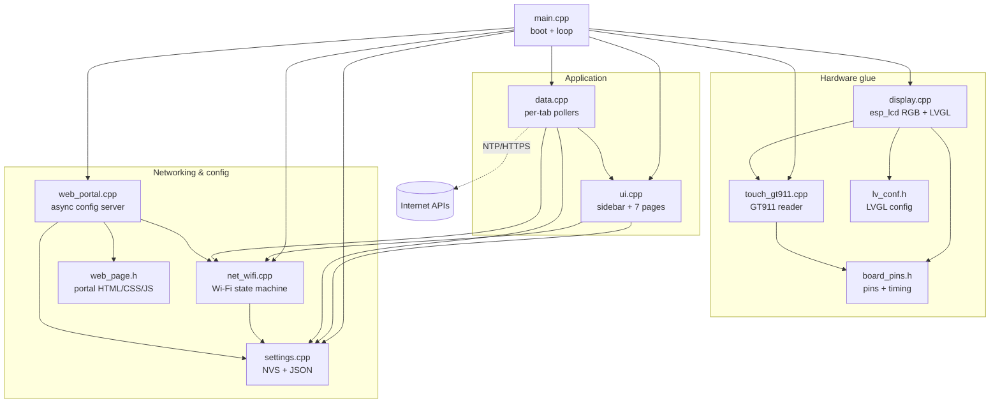
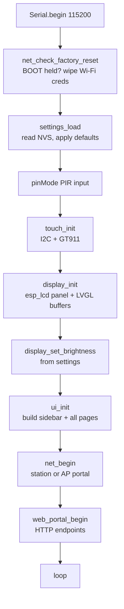
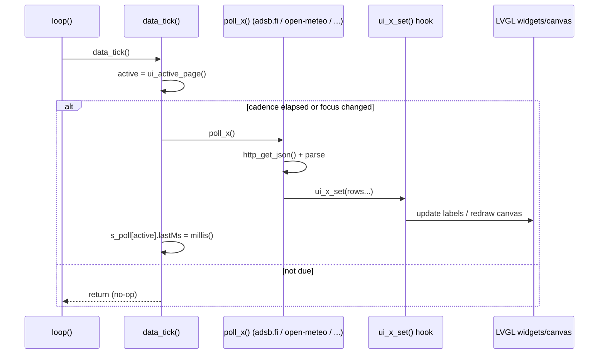
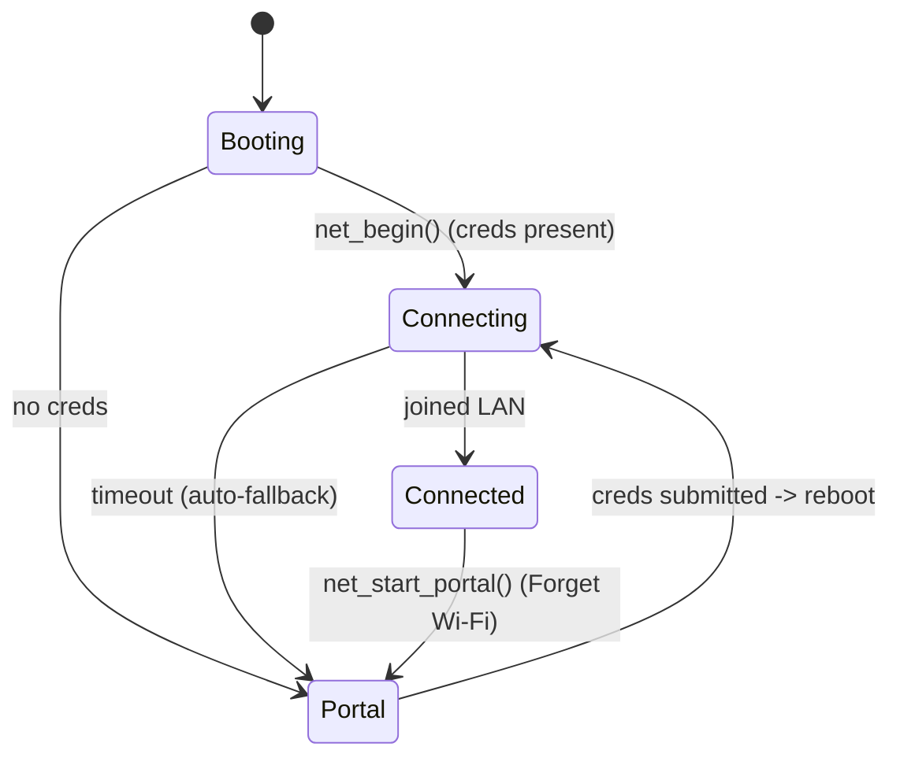

# Architecture — CrowPanel ESP32 Desk Dashboard

A wall/desk information dashboard running on the **Elecrow CrowPanel ESP32 HMI 5.0"**
(module **DIS07050H**): an 800×480 parallel-RGB touchscreen driven by an ESP32-S3, built
with **PlatformIO + LVGL 8.3**. It shows seven tabs — Home (clock + weather + sun/moon +
hourly), Flights (live ADS-B radar), Calendar (iCal), Tickers (stock/crypto sparklines),
Air (US AQI + UV + motion), Diag (device stats), and Config (Wi-Fi setup QR + web portal).

This document is the complete technical reference — hardware wiring, the display driver,
module design, data flow, and build details. The [README](README.md) is the high-level
overview of the board and what the dashboard does.

---

## 1. Design at a glance

- **No RTOS app tasks, no OOP class hierarchy.** The firmware is a set of **C-style
  modules** — each `.cpp` owns its file-static state and exposes a small function API
  through its header. Everything runs cooperatively on the single Arduino `loopTask`.
- **One cooperative loop.** `loop()` pumps networking, data polling, UI housekeeping, and
  the display in a fixed order every ~5 ms. Any blocking call (a slow TLS handshake, a
  heavy canvas render) stalls *everything*, so blocking is actively bounded (see §7).
- **Data is pull-per-tab.** The data layer polls only the data source behind the
  currently-visible tab, syncing immediately on focus change (see §6).
- **The display is the hard part.** A streamed RGB panel with no frame RAM is kept
  glitch-free by an `esp_lcd` bounce buffer and a VSYNC-synchronised buffer swap (see §5.1).

---

## 2. Hardware & toolchain

| Aspect | Detail |
| --- | --- |
| **SoC** | ESP32-S3-WROOM-1-**N4R8** — 4 MB flash, **8 MB Octal PSRAM** (`qio_opi`) |
| **Display** | 800×480 16-bit RGB565 parallel panel (ILI6122/ILI5960), **no frame RAM** — streamed continuously from PSRAM |
| **Pixel clock** | 12 MHz (validated factory timing, paired with the bounce buffer) |
| **Touch** | GT911 capacitive controller over I²C (`0x5D`) |
| **IO expander** | PCA9557 (`0x18`) — GT911 reset line on v3.0 boards |
| **Console** | UART0 via onboard CH340. Native USB-CDC is **impossible** (USB pins GPIO19/20 are the I²C bus) |
| **Sensors/IO** | Grove PIR on GPIO38 (screen wake/dim); BOOT button GPIO0 (Wi-Fi factory reset) |
| **Toolchain** | pioarduino fork = Arduino-ESP32 **3.3.11** / ESP-IDF **5.5.5**; LVGL **8.3.11** |
| **Env** | PlatformIO env `crowpanel-50`; loop task stack raised to 16 KB |

Pin assignments and RGB timing constants live in [src/board_pins.h](src/board_pins.h) and
are the single source of truth for hardware wiring. Because the parallel-RGB bus consumes
most of the GPIO, **free pins are scarce** — the digital header (IO38), the UART header
(IO43/44), and the shared I²C bus are the practical expansion points.

### 2.1 Pin map

**Display — 16-bit RGB565 parallel bus.** Data-line order is `d0..d4 = Blue`,
`d5..d10 = Green`, `d11..d15 = Red`.

| Signal | GPIO | | Signal | GPIO | | Signal | GPIO |
|---|---|---|---|---|---|---|---|
| B0 | 8  | | G0 | 5  | | R0 | 45 |
| B1 | 3  | | G1 | 6  | | R1 | 48 |
| B2 | 46 | | G2 | 7  | | R2 | 47 |
| B3 | 9  | | G3 | 15 | | R3 | 21 |
| B4 | 1  | | G4 | 16 | | R4 | 14 |
|    |    | | G5 | 4  | |    |    |

| Control | GPIO | | Control | GPIO |
|---|---|---|---|---|
| DE (data enable) | 40 | | PCLK | 0 |
| VSYNC | 41 | | Backlight (PWM) | 2 |
| HSYNC | 39 | |  |  |

**RGB timing:** HSYNC front/pulse/back = 8/4/43, VSYNC front/pulse/back = 8/4/12, pixel
clock **12 MHz**, `pclk_active_neg = 1`.

| Bus / device | Pins |
|---|---|
| I²C (GT911 touch, PCA9557, optional ADS1115) | SDA = 19, SCL = 20 |
| microSD (SPI) | MOSI = 11, MISO = 13, CLK = 12, CS = 10 |
| I²S audio | LRCLK = 18, BCLK = 42, DIN = 17 |
| UART0 (console / Grove GPS) | RX = 44, TX = 43 |
| Digital header (PIR) | GPIO38 |
| BOOT button | GPIO0 |

I²C addresses: GT911 `0x5D` (alt `0x14`), PCA9557 `0x18`, ADS1115 `0x48`.

### 2.2 Software stack & build config

| Component | Role | Notes |
|---|---|---|
| PlatformIO + pioarduino (Arduino-ESP32 3.3.11 / ESP-IDF 5.5.5) | build/flash | Core 3.x is required for the modern `esp_lcd` RGB driver |
| `esp_lcd` RGB panel (bundled with the core) | display driver | Double framebuffer + bounce buffer; config in [src/display.cpp](src/display.cpp) |
| LVGL 8.3.11 | UI toolkit | Config in [src/lv_conf.h](src/lv_conf.h) |
| Minimal GT911 driver | touch | [src/touch_gt911.cpp](src/touch_gt911.cpp); handles PCA9557 reset |
| ArduinoJson | parse APIs + config | Streaming parse with field filters keeps memory bounded |
| ESPAsyncWebServer + AsyncTCP | web config server | Non-blocking config UI + captive portal |
| DNSServer / ESPmDNS | captive portal / `crowpanel.local` | Zero-config access |
| Preferences (NVS) | settings storage | Survives reboot and re-flash |
| QRCode | on-screen QR | Config tab link to the web UI |

**Key `platformio.ini` settings:** `board_build.arduino.memory_type = qio_opi` (Octal
PSRAM), `board_build.partitions = huge_app.csv` (3 MB app on 4 MB flash),
`ARDUINO_USB_MODE=1` + `ARDUINO_USB_CDC_ON_BOOT=0` (the ESP32-S3 native-USB pins
GPIO19/20 are used by the I²C bus, so the serial console must stay on **UART0** via the
onboard CH340 bridge — USB-CDC can never work on this board), `BOARD_HAS_PSRAM`.

### 2.3 Board revisions & optional sensors

Board revisions `v1 / v2 / v3`: v3 adds a PCA9557-driven touch-reset init step; v2+
support auto-download (no manual BOOT press to flash). The firmware performs a best-effort
PCA9557 reset pulse and works without it if the expander is absent.

Optional Grove modules on the exposed headers:

- **PIR (digital) → GPIO38** — screen wake/dim on motion; also shown on the Air page.
- **GPS (UART) → UART0 (RX 44 / TX 43)** — UART0 is **shared with the serial console**
  (native USB-CDC is unavailable on this board), so use it for GPS only when the console
  isn't attached.

Air quality needs no sensor — the Air page pulls US AQI and pollutant data from the
keyless Open-Meteo Air Quality API. There is no free native ADC pin (the RGB bus consumes
the ADC-capable GPIOs), so an analog Grove air sensor is not supported.

---

## 3. Module map

Each box is a translation unit (`.cpp` + `.h`); arrows are compile-time dependencies
(caller → callee).



**Data providers** (all keyless HTTPS): Open-Meteo (weather, air, UV, sun), adsb.fi
(flights), Yahoo Finance chart API (tickers), and any user-supplied iCal `.ics` URL.

---

## 4. Boot sequence

`setup()` in [src/main.cpp](src/main.cpp) brings the system up in dependency order. The
factory-reset check runs *first* so a held BOOT button can wipe credentials before they're
ever loaded.



---

## 5. Runtime model

There is exactly one execution context: the Arduino `loopTask`, with its stack raised to
**16 KB** (`SET_LOOP_TASK_STACK_SIZE(16 * 1024)`) because mbedTLS handshakes are
stack-hungry and can overlap a calendar fetch.

```cpp
void loop() {
    net_tick();                                   // 1. drive Wi-Fi state machine
    if (web_portal_consume_wifi_changed())        // 2. new creds submitted?
        ESP.restart();                            //    reboot to apply
    data_tick();                                  // 3. poll the focused tab's source
    ui_tick();                                    // 4. clock + live page housekeeping
    display_tick();                               // 5. pump LVGL render + flush
    delay(5);                                      // 6. yield
}
```

**Order matters.** `display_tick()` runs last, so if any earlier step blocks (network or a
heavy render) LVGL can't refresh and touch appears frozen. This constraint drives several
design decisions in §7.

### 5.1 Display driver — tear-free RGB (the hard-won part)

The 5.0" panel is a **raw 16-bit parallel RGB** display: there is no frame RAM on the
panel, so the ESP32-S3 must continuously stream all 800×480 pixels out of PSRAM, scanline
by scanline, forever. Getting this stable was the hardest part of the bring-up. All logic
is in [src/display.cpp](src/display.cpp); pins and timing are in
[src/board_pins.h](src/board_pins.h).

**Driver: `esp_lcd` (not LovyanGFX).** The panel is driven by the `esp_lcd` RGB panel
driver bundled in the Arduino-ESP32 core. An earlier revision used LovyanGFX; it was
removed (`lgfx_crowpanel.h` and the dependency are gone). `esp_lcd` is the same driver the
Elecrow factory example uses, is on the latest maintained ESP-IDF, and exposes the two
knobs that make the panel stable — the double framebuffer and the bounce buffer.

**The symptom: a constant "shaky"/shimmering screen.** A raw RGB panel is fed from a small
on-chip pixel FIFO that DMA refills from the framebuffer in PSRAM. When a PSRAM read
arrives late — and PSRAM latency spikes whenever the CPU, Wi-Fi, and LVGL all hit it — the
FIFO **underruns** and the display shimmers/tears independently of the pixel clock. Things
that do **not** fix it: lowering the pixel clock, adding framebuffers, or switching LVGL
render modes (`full_refresh` actually made it worse). The axis that matters is **PSRAM
read bandwidth/latency to the panel FIFO**.

**The fix: a bounce buffer** — a small chunk of fast internal SRAM that DMA pre-fills a few
scanlines ahead of the beam, so the FIFO is always fed from SRAM and never waits on PSRAM.
We prefetch 10 lines. These values are copied verbatim from the Elecrow factory
`Bus_RGB.cpp`:

```c
cfg.clk_src               = LCD_CLK_SRC_PLL160M;  // stable 160 MHz clock source
cfg.num_fbs               = 2;                     // double framebuffer in PSRAM
cfg.bounce_buffer_size_px = LCD_WIDTH * 10;        // <-- prefetch 10 lines into SRAM
cfg.dma_burst_size        = 64;                     // factory DMA burst length
cfg.flags.fb_in_psram     = 1;                       // framebuffers live in PSRAM
```

The **bounce buffer is the thing that eliminates the shimmer.** Everything else just keeps
us on the exact validated factory timing (12 MHz pixel clock + the porches in
[src/board_pins.h](src/board_pins.h)).

**Tear-free swap: draw, then wait one VSYNC.** LVGL renders in `full_refresh` mode into the
back framebuffer, so both buffers always hold a complete frame. On the final flush we
present that buffer and then wait for the panel to latch it (one VSYNC) before letting LVGL
draw the next frame — never swapping to a buffer the CPU is still writing, never drawing
into the buffer being scanned out. The VSYNC callback just bumps a counter; the flush waits
for it to advance. This is the `esp_lcd` equivalent of the factory `presentFrameBuffer()`:

```c
static bool IRAM_ATTR on_vsync(...) { ++s_vsync_count; return false; }   // VSYNC ISR

uint32_t count = s_vsync_count;                                          // flush:
esp_lcd_panel_draw_bitmap(s_panel, 0, 0, LCD_WIDTH, LCD_HEIGHT, color_p);
while (s_vsync_count == count) { if (timed_out) break; taskYIELD(); }
```

| Setting | Value | Why |
|---|---|---|
| Driver | `esp_lcd` RGB (ESP-IDF 5.5.5) | Same driver as the factory example |
| `clk_src` | `LCD_CLK_SRC_PLL160M` | Stable clock source |
| `num_fbs` | `2` | Double framebuffer → no tearing |
| `bounce_buffer_size_px` | `LCD_WIDTH * 10` | **Cures the shimmer** |
| `dma_burst_size` | `64` | Factory DMA burst length |
| `fb_in_psram` | `1` | Two 800×480×16-bit buffers only fit in PSRAM |
| Pixel clock | `12 MHz` | Validated factory timing |
| Render mode | LVGL `full_refresh` | Both buffers stay coherent |
| Swap | draw → wait 1 VSYNC | Tear-free present |

**Porting to the 7.0" board?** The pin map, porches, and pixel clock all differ on the
7.0" (DIS08070H) — change the constants in [src/board_pins.h](src/board_pins.h), do not
reuse the 5.0" values. Keep the bounce buffer; it is board-independent and is what makes
any raw-RGB panel stable.

---

## 6. The page/data model

### 6.1 Pages

The UI is a fixed set of pages indexed by the `Page` enum in [src/ui.h](src/ui.h):

```
PAGE_HOME, PAGE_FLIGHTS, PAGE_CALENDAR, PAGE_TICKERS, PAGE_AIR, PAGE_DIAG, PAGE_CONFIG
```

`ui_show_page()` sets the visible page; `ui_active_page()` reports it so the data layer
knows what to poll. A left sidebar of buttons switches pages.

### 6.2 Per-tab polling

[src/data.cpp](src/data.cpp) drives all remote data through a **descriptor table** rather
than per-tab classes — one function pointer + a `lastMs` timestamp per page:

```cpp
struct PagePoll { void (*poll)(); uint32_t lastMs; };
static PagePoll s_poll[PAGE_COUNT] = { {poll_weather,0}, {poll_flights,0}, ... };
```

`data_tick()` each loop:

1. No-ops unless `net_state() == Connected`.
2. Updates the PIR motion indicator (cheap, every tick).
3. Services one-off refresh requests (`s_flightsDirty`, `s_tickersDirty`) from zoom /
   timeframe changes.
4. Reads `ui_active_page()`. On a **focus change** it sets that page's `lastMs = 0` to
   force an immediate sync.
5. Calls the active page's poller if its cadence elapsed. `lastMs` is stamped **after**
   the poll returns, so a slow fetch can't immediately re-trigger itself.

Cadence is `settings().pollSeconds` (default 60 s), except **Flights is capped at 10 s**
for a live radar, and **Calendar** uses its own 15-minute gate (`poll_calendar_gate`) that
also reacts to a changed `.ics` URL. `DIAG`/`CONFIG` have no poller.



### 6.3 Data-push hooks

The data layer never touches LVGL objects directly; it calls typed **push hooks** declared
in [src/ui.h](src/ui.h), e.g. `ui_weather_set()`, `ui_forecast_set(DayForecast*)`,
`ui_flights_set(FlightRow*)`, `ui_tickers_set(TickerRow*)`, `ui_calendar_set(CalEvent*)`,
`ui_air_set()`, `ui_air_uv_set()`, `ui_sun_set()`, `ui_hourly_set(HourCell*)`, plus an
`ui_*_error()` for each. This keeps parsing (data.cpp) and rendering (ui.cpp) decoupled and
gives each feed a small, explicit contract (the row/cell structs).

### 6.4 Data sources & APIs

All feeds are **keyless** and fetched over HTTPS (`WiFiClientSecure::setInsecure()`).

| Feed | Endpoint / source | Notes |
|---|---|---|
| Weather, air, UV, sun | Open-Meteo (`api.open-meteo.com`, `air-quality-api`, geocoding) | No key, no attribution required |
| Flights | adsb.fi (`opendata.adsb.fi/api/v3/lat/{lat}/lon/{lon}/dist/{NM}`, ≤ 250 NM) | **Credit required**, non-commercial, ~1 req/sec |
| Tickers | Yahoo Finance chart API (`query1.finance.yahoo.com/v8/finance/chart/{sym}`) | Needs a `User-Agent` header or it 403s |
| Calendar | user-supplied public `.ics` URL | Streamed, not buffered into JSON |

adsb.fi fields used: `r` (registration / tail #, falls back to the `flight` callsign), `t`
(type), `alt_baro`, `lat`, `lon`. The Flights tab shows a small "data: adsb.fi" credit as
required by their terms.

---

## 7. Module reference

### `main.cpp` — entry point
Owns `setup()` (boot order, §4) and `loop()` (the cooperative pump, §5). Raises the loop
stack to 16 KB and reboots when the portal reports changed Wi-Fi credentials.

### `board_pins.h` — hardware constants
All display data/control pins, RGB porch/pulse timing, `LCD_PCLK_HZ` (12 MHz), the shared
I²C pins, device I²C addresses, SD/I²S pins, and the PIR/BOOT/UART headers. Values are
validated against the Elecrow 5.0" reference and are panel-specific (a 7.0" board differs).

### `display.cpp` / `display.h` — the display driver *(timing-critical)*
Brings up the **`esp_lcd` RGB panel driver** (not LovyanGFX — that was removed), allocates
the LVGL draw buffers, and registers LVGL's display + touch input drivers.

- **`display_init()`** — configures the panel: `clk_src = LCD_CLK_SRC_PLL160M`,
  `num_fbs = 2`, `flags.fb_in_psram = 1`, **`bounce_buffer_size_px = LCD_WIDTH * 10`**,
  `dma_burst_size = 64`, 12 MHz pixel clock. LVGL runs in `full_refresh` mode with the two
  framebuffers as draw buffers.
- **`display_tick()`** — pumps `lv_timer_handler()` and performs the flush.
- **`display_set_brightness(0..255)`** — backlight PWM.

> **The bounce buffer and the VSYNC-counter swap are the whole trick — see §5.1 for the
> full story** (symptom, fix, config cheat-sheet, and porting to the 7.0" board).

### `touch_gt911.cpp` / `touch_gt911.h` — capacitive touch
Reads the GT911 over the shared I²C bus and returns a scaled `TouchPoint` to LVGL's input
driver. `pca9557_reset_gt911()` pulses the reset line via the PCA9557 expander on boards
that need it. The GT911 self-initialises at power-on, so this module only reads points.

### `ui.cpp` / `ui.h` — the LVGL shell and pages *(largest module)*
Builds the sidebar nav and all seven pages (`build_home`, `build_flights`, …), exposes
`ui_show_page()` / `ui_active_page()`, runs `ui_tick()` housekeeping (clock text, live
Diag/Config values, net-state page switching), and implements every `ui_*_set()` push hook.

- **Flights radar** is drawn on a 400×400 PSRAM canvas. Range rings are plotted point-by-
  point via the `canvas_ring()` helper using `lv_canvas_set_px_color`. **`lv_canvas_draw_arc`
  is deliberately avoided** — full-circle arcs hang at larger radii under LVGL 8.3 (see §8).
- The Config-tab QR code and ticker sparklines are also LVGL canvases.

### `data.cpp` / `data.h` — network data services
NTP time plus all HTTPS JSON polling behind the per-tab descriptor table (§6.2).

- **`http_get_json()`** — the shared TLS/HTTP helper (`setInsecure`, an **8-second
  handshake timeout**, 8 s connect/read timeouts, GET, error handling) used by weather,
  air, flights, and tickers. `poll_calendar()` streams its (potentially multi-MB) `.ics`
  body manually instead of buffering JSON.
- **Time:** `data_begin_time()` seeds the clock in UTC; `apply_utc_offset()` re-applies the
  local offset on each successful weather poll (this coupling is a known limitation, §9).
- **Parsers/structs:** `FlightRow`, `TickerRow` (+`spark[SPARK_N]`), `CalEvent`,
  `DayForecast`, `HourCell` — each parser fills its struct and calls the matching push hook.

### `net_wifi.cpp` / `net_wifi.h` — Wi-Fi lifecycle
A small state machine plus a 3-layer (re-)provisioning model.



Provisioning layers: **(1)** web form writes creds to NVS; **(2)** auto-fallback to the AP
captive portal when the saved network can't be joined; **(3)** hardware failsafe — hold
BOOT ~5 s at power-on to wipe creds. Accessors expose `net_state()`, `net_ssid()`,
`net_ip()`, `net_hostname()`.

### `web_portal.cpp` / `web_portal.h` / `web_page.h` — config server
An `ESPAsyncWebServer` on port 80 serving the config UI ([web_page.h](src/web_page.h),
embedded HTML/CSS/JS). Endpoints: `GET /` (page), `GET /api/config`, `GET /api/scan`
(Wi-Fi scan), `POST /api/config` (save). Captive-portal probes (`/generate_204`,
`/hotspot-detect.html`, `/ncsi.txt`, catch-all `onNotFound`) redirect phones to the form.
An optional PIN gates config access. On save it raises the flag that
`web_portal_consume_wifi_changed()` returns to the main loop.

### `settings.cpp` / `settings.h` — persistent config
The `Settings` struct (14 fields) is the single source of truth. `settings_load()` /
`settings_save()` map each field to an NVS key via the `Preferences` library (keys are
abbreviated, e.g. `useMetric`→`"metric"`, `use24hClock`→`"clk24"`), and JSON import/export
back the portal's config API. `settings()` returns the live instance.

### `lv_conf.h` — LVGL build configuration
Compile-time LVGL options (enabled fonts, color depth RGB565, feature flags) for this
panel.

---

## 8. Key design decisions & gotchas

| Decision / gotcha | Why |
| --- | --- |
| **Bounce buffer** (`LCD_WIDTH*10` px) | The real fix for RGB FIFO starvation / screen shimmer. Do not remove; it pairs with the 12 MHz clock. |
| **VSYNC-counter swap** | Presents frames tear-free — draw first, then wait one VSYNC. |
| **8 s TLS handshake cap** | `WiFiClientSecure` defaults to a **120 s** handshake timeout; a stalled handshake froze the whole loop (and UI) for up to two minutes. |
| **Stamp `lastMs` *after* the poll** | Stamping before a slow poll re-triggers it every tick → re-poll storm / permanent freeze. |
| **`canvas_ring()` instead of `lv_canvas_draw_arc`** | LVGL 8.3 full-circle arcs hang at larger radii; the point-plotted ring is bounded and cheap. |
| **Per-tab polling** | Avoids fetching (and rendering) data for hidden tabs; syncs instantly on focus. |
| **Single cooperative loop** | Simple and deterministic, but means *no* step may block — hence the timeouts and bounded renders above. |
| **16 KB loop stack** | mbedTLS handshakes overlapping a calendar fetch overflow the default 8 KB stack. |
| **No vendored libraries** | Stay on published LVGL / Arduino-ESP32; write only minimal glue (e.g. the VSYNC swap). |

---

## 9. Known deferred items

- **Timezone is applied only on a successful weather poll.** If weather fails, the clock
  stays on UTC. Candidate fix: apply the saved offset at boot, independent of weather.
- **Startup DNS `-54` stalls.** Candidate fix: set static DNS (8.8.8.8 / 1.1.1.1) in
  `net_wifi` when starting the station connection.

---

## 10. Source layout

| File | Responsibility |
| --- | --- |
| [src/main.cpp](src/main.cpp) | Boot, factory-reset check, cooperative loop |
| [src/board_pins.h](src/board_pins.h) | Pins, RGB timing, I²C addresses |
| [src/display.cpp](src/display.cpp) / [.h](src/display.h) | esp_lcd RGB panel + LVGL + tear-free flush |
| [src/touch_gt911.cpp](src/touch_gt911.cpp) / [.h](src/touch_gt911.h) | GT911 reader + PCA9557 reset |
| [src/ui.cpp](src/ui.cpp) / [.h](src/ui.h) | Sidebar nav, pages, push hooks, radar canvas |
| [src/data.cpp](src/data.cpp) / [.h](src/data.h) | NTP, per-tab HTTPS pollers, parsers |
| [src/net_wifi.cpp](src/net_wifi.cpp) / [.h](src/net_wifi.h) | Wi-Fi state machine + provisioning |
| [src/web_portal.cpp](src/web_portal.cpp) / [.h](src/web_portal.h) | Async config server + captive portal |
| [src/web_page.h](src/web_page.h) | Embedded portal HTML/CSS/JS |
| [src/settings.cpp](src/settings.cpp) / [.h](src/settings.h) | NVS-backed settings + JSON |
| [src/lv_conf.h](src/lv_conf.h) | LVGL compile-time configuration |
